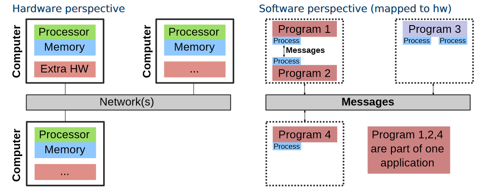
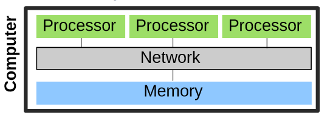

# Lecture 01: Lecture Overview. Use Cases.

## Learning Outcomes
- [x] Name typical applications for high-performance data analytics
- [x] Distinguish HPDA from D/P/S computing and how these topics blend
- [x] Describe use-cases and challenges in the domain of D/P/S computing
- [x] Describe how the scientific method relies on D/P/S computing
- [x] Name big data challenges and the typical workflow
- [x] Recite system charactersitics for distributed/parallel/computational science
- [x] Sketch generic D/P system architectures

## HPDA

---
Q: 
What is HPDA? 
What is its goal? 
How is it done?
---
A:
- HPDA is a process
- To analyzte **big** data **fast**
- by using **HPC** and **Parallel Computing**
---

## Distributed Computing

---
Q:
What is distributed Computing?
---
A: 
Computing done via networked computers.
---

---
Q:
How is communication and coordination done in distributed Computing?
---
A:
Via messaging protocols.
---

---
Q: Sketch out a generic Distributed Computing architecture, both from SW and HW perspective
---
A: 
---

---
Q: What are examples of distributed Applications?
---
A:
- The internet as a whole
- sth sth web3
- volunteer computing
- grid computing
- cloud computing, especially on the edge
- IoT
---

---
Q: What are some example distributed Algorithms?
---
A:
- Consensus
- Master election in master/slave
- Reliable broadcasting
---

---
Q: What makes Cloud Computing Special?
---
A: That it has **on demand availability** and **on demand scalability**
---

---
Q: What are 6 challenges related to distributed systems?
---
A:
- Concurrency makes it harder to understand the system
- Distributed is harder to debug
- Scale up shared resources like Databases or storage
- Failure-Resistance (Failure WILL happen)
- Heterogeneity of large systems
- Keep state consistent between machines
---

---
Q: Why is fault resistance so important in distributed computing?
---
A: Because with so many machines, some machine will always be down.
---

---
Q: Why is it so hard to manage the state of distributed programs?
---
A:
- Because it is hard to reason about
- Because the coordination is networked, (lossy, jitter, not-in-order)
- Because some systems die, thus everything is replicated and sharded
---

## Parallel Computing and HPC

---
Q: What is parallel computing?
---
A: Many calculations done **simultaneously**
---

---
Q: Does parallel computing imply distributed computing?
---
A: No. Examples:
- Multi-CPU
- Parallel Bits: SIMD, Intel MMX
- Parallel Instructions: Pipelining
---

---
Q: What are four HW levels of parallelism?
---
A: 

1. Bit level: process multiple bits, vectorized (SIMD)
2. Instruction level: Pipelining in different parts of CPU
3. Data level: Run Same Computation of different Data (GPU)
4. Task Level: Run different computations concurrently (big system)
---

---
Q: What are the two parallel systems architectures?
---
A:
1. Shared memory systems (big multi cpu systems)
2. Distibuted memory systems (multiple machines)
---

--- 
Q: Sketch out a generic shared memory parallel computing architecture
---
A:

---

--- 
Q: Sketch out a generic distributed memory parallel computing architecture
---
A:

---

---
Q: What are the advantages and disadvantages of shared memory systems?
---
A:
Advantages:
- Easier communication / coordination through memory
- not reliant on best-effort network
- Easier to program for
- Faster inter-node access times (single node lol)

Disadvantages:
- More fault tolerant
- More expensive
- Not infinitely scalable

---

---
Q: What are the advantages and disadvantages of distributed memory systems?
---
A:
Advantages:
- Less fault tolerant
- Cheaper
- Infinitely scalable (not linear)

Disadvantages:
- More complicated communication (network vs memory)
- More complicated coordination (clock sync, network)
- reliant on best-effort network
- harder to develop for
- slower inter-node access times
---

---
Q: Why wouldn't you just use shared memory systems?
---
A:
Because you can't scale up a single machine infinitely.
It also gets disproportionately expensive.
---

---
A: How does a multicore processor archieve all 4 levels of parallism?
What were the 4 levels of parallelism?
---
A:
1. **Bit-Level**: Multiple ALUs

2. **Instruction-Level**: Pipelining

3. **Data-Level**: SIMD

4. **Task-Level**: Multiple Cores with multiple instruction pointer
---

---
Q: Why is developing parallel computing applications hard?
---
A: 
- Lot of low level optimizations for maximal performance
- hard to debug many concurrent processes
---

## Computational Science

---
Q: Where is D/P computing used in the scientific method?
---
A:
1. Getting data through simulations
2. Analyzing data through big data analytics
---

---
Q: When can simulations be better than real life observations?
---
A: When the simulation is faster than real time.

Example: atomic decay over multiple decades.
---

---
Q: What are the modern 4 pillars of science?
---
A:
1. Theory
2. Experimentation
3. Simulation
4. Big Data Analytics
---

---
Q: What is the goal of Big Data Analytics?
---
A: Extracting insight from data to support decisions
---

---
Q: How does the scientific method rely on Simulation models?
---
A:
- The digital equivalent for experimentation
- Used to refine and validate theories
- Cheaper; faster; not bound to real-time
---

---
Q: How does the scientific method rely on Big Data Analytics?
---
A:
- Can process larger amount of data
- Mostly useful for approxiamte insight
---

## BigData Challenges

---
Q: What are the 5Vs?
---
A:
- Volume
- Velocity
- Variety
- Veracity
- Value
---

---
Q: What is meant by the volume of data? What are the 5Vs?
---
A:
The volume is the sheer amount of data.

- Volume
- Velocity
- Variety
- Veracity
- Value
---

---
Q: What is meant by the velocity of data? What are the 5Vs?
---
A:
How much the data volume increases. If the volume stays the same, its not a big data problem.

- Volume
- Velocity
- Variety
- Veracity
- Value
---

---
Q: What is meant by the variety of data? What are the 5Vs?
---
A: The type of data, i.e. structured, semistructured and unstructured.

- Volume
- Velocity
- Variety
- Veracity
- Value
---

---
Q: What is meant by the veracity of data? What are the 5Vs?
---
A: How trustworthy the data is, i.e. how many mistakes, ambiguities or just wrong information.

If the data is trash, you cant do good analysis.

- Volume
- Velocity
- Variety
- Veracity
- Value
---

---
Q: What is meant by the Value of Data? What are the 5Vs?
---
A: How much one can find out of the data. 
Structured data is obviously more valuable than unstrcutered data.
Processed results have more value than unprocessed structured data.

- Volume
- Velocity
- Variety
- Veracity
- Value
---

## Use Cases

---
Q: What are non-scientific use cases for Big Data Analytics? (At least 3)
---
A:
- Targeted Advertisement
- Recommendation Systems
- Fraud Detection
- Insurance Modelling
- Peak Usage Prediction
---

---
Q: What are scientific use cases for Big Data Analytics? (At least 3)
---
- Protein Folding
- Personalized Healthcare
- Anomaly detection for CT / MRI images
- autonomic driving
---
